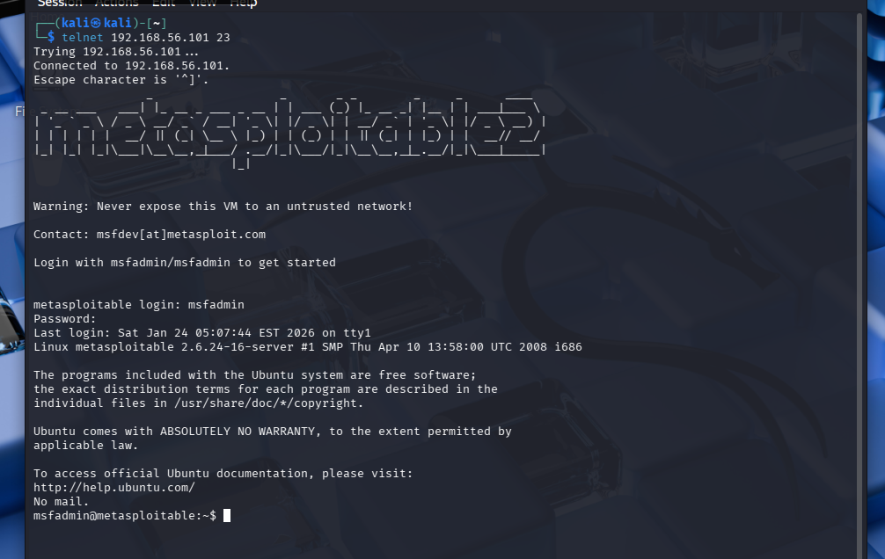
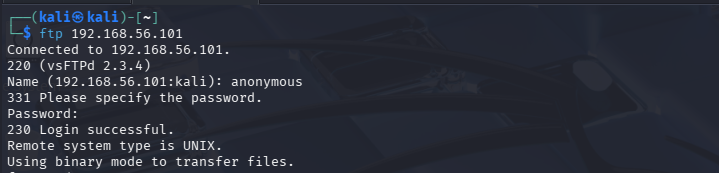

## Telnet Initial Access
Initial access validation was performed to determine whether the exposed Telnet service presents a realistic authentication attack surface. Actions were deliberately limited to validating exposure and risk, without progressing beyond initial access.

### Telnet Exposure Assessment
A connection to the Telnet service was successfully established, and an interactive login prompt was presented. This confirmed that the service is accessible from the network and accepts authentication attempts over an __unencrypted channel__.

Based on this validation, the Telnet service was confirmed to present a realistic initial access vector. Further authentication testing could be justified in a controlled engagement scenario.

## Initial Access Demonstration
This section demonstrates how an attacker could obtain an initial foothold via an exposed Telnet service using known default credentials within a controlled lab environment. The demonstration is intentionally limited to initial access only.

### Result
Authentication to the Telnet service was successful using documented default credentials. This confirms that an attacker could gain an initial foothold on the system without exploiting a software vulnerability, relying solely on weak configuration.

### Impact Assessment
Successful access via Telnet provides interactive command-line access to the system. From this position, an attacker could potentially enumerate the system, access sensitive files, or attempt lateral movement.

### Why This Worked
This issue exists due to the use of an insecure legacy protocol combined with default credentials. Telnet transmits authentication data in cleartext and provides no protection against credential interception.

### Recommended Remediation
- Disable Telnet and replace it with SSH
- Enforce strong, unique credentials
- Restrict remote management services using network controls
- Monitor authentication attempts on remote access services

## FTP Initial Access
This section demonstrates how an attacker could gain initial access or sensitive information through an exposed FTP service due to insecure configuration. The demonstration is limited to validating access and does not involve exploitation beyond authentication.

### Result
The FTP service permitted __anonymous authentication__, allowing unauthenticated users to access the file system. This confirms that the service presents a viable initial access vector without the need for valid credentials.

### Impact Assessment
Anonymous FTP access may allow attackers to retrieve sensitive files, upload malicious content, or gather information useful for further compromise. Even read-only access can significantly aid reconnaissance and follow-on attacks.

### Why This Worked
This issue exists due to anonymous FTP being enabled on an externally accessible service. Such configurations are commonly abused and are generally unnecessary on modern systems.

### Recommended Remediation
- Disable anonymous FTP access
- Restrict FTP access to authenticated users only
- Replace FTP with secure alternatives such as SFTP
- Monitor and log file access activity
